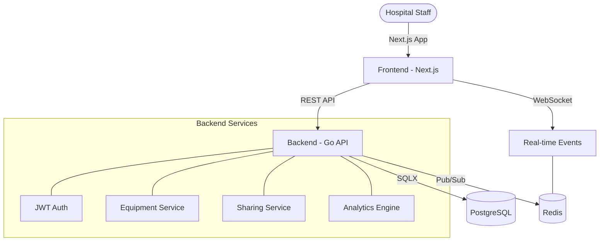

# 

<div align="center">
  <h3>Next-Generation Hospital Equipment Utilization & Sharing Platform</h3>
  <p>
    
    
    
    
    
  </p>
</div>

---

## 🌟 Vision

**MediFlow** is a mission-critical SaaS platform designed to solve one of healthcare's most persistent challenges: **Equipment Inefficiency**. By providing real-time visibility into medical inventory and orchestrating intelligent sharing workflows between departments, MediFlow reduces idle time for expensive assets and ensures that life-saving equipment is always where it's needed most.


---

## 🚀 Key Capabilities

### 📡 Real-Time Visibility
Track equipment availability across the entire hospital or health system in real-time using our high-performance WebSocket engine backed by Redis.

### 🤝 Intelligent Sharing Workflow
A structured, digital lifecycle for equipment sharing requests—from initial request to physical handover and return—eliminating the need for manual tracking and frantic phone calls.

### 📊 Analytics & Insights
Gain deep operational visibility with integrated analytics. Track utilization rates, identify bottlenecks, and optimize procurement based on actual usage data.

### 🏢 Multi-Tenant Architecture
Built from the ground up to support multiple departments or even multiple hospital locations with strict data isolation and secure access control.

---

## 🏗️ Technical Architecture

MediFlow uses a modern, high-concurrency architecture designed for stability and speed.



### Stack
- **Frontend**: `Next.js 15` (App Router), `TypeScript`, `Tailwind CSS`, `Lucide React`
- **Backend**: `Go 1.23`, `chi` (Routing), `sqlx` (DB), `zerolog` (Logging)
- **Persistence**: `PostgreSQL 16`
- **Real-time/Cache**: `Redis 7` (Pub/Sub & WebSocket synchronization)
- **Orchestration**: `Docker` & `Docker Compose`

---

## 🛠️ Repository Structure

```bash
.
├── backend/          # High-performance Go API & Domain Services
│   ├── cmd/          # Entry points
│   ├── internal/     # Core logic (Auth, Alert, Equipment, Shared)
│   └── migrations/   # SQL Schema definitions
├── frontend/         # Premium Next.js Analytics Dashboard
│   ├── src/app/      # App Router & Pages
│   └── src/components/ # Reusable UI components
├── docker-compose.yml # Full-stack orchestration
└── .env.example      # Environment template
```

---

## ⚡ Quick Start

### 1. Prerequisites
Ensure you have **Docker** and **Docker Compose** installed on your machine.

### 2. Environment Setup
Clone the repository and prepare your environment variables:
```bash
cp .env.example .env
```

### 3. Launch Platform
Start the entire infrastructure (Frontend, Backend, DB, Redis):
```bash
docker compose up --build
```

### 4. Access
- **Frontend**: [http://localhost:3000](http://localhost:3000)
- **API Health**: [http://localhost:8080/health](http://localhost:8080/health)

---

## 🛡️ Quality & Security
- **Multi-Tenant Isolation**: Data is separated by `tenant_id` at the database level.
- **JWT Authentication**: Secure, stateless authentication for all API endpoints.
- **Real-time Safety**: Redis-backed WebSockets ensure event delivery consistency.

---

## 🤝 Contributing
We welcome contributions! Please see our [CONTRIBUTING.md](CONTRIBUTING.md) for guidelines on how to get involved.

## 📄 License
MediFlow is open-source software licensed under the [MIT License](LICENSE).

---
<div align="center">
  Created with ❤️ by the MediFlow Team
</div>
